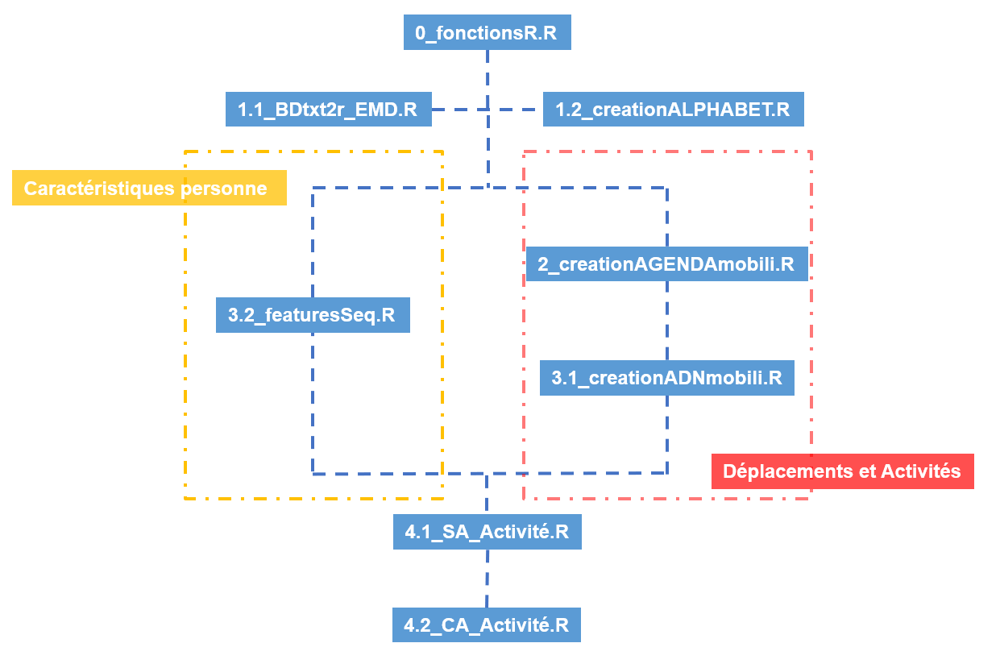

# Analyse De l'Equête Ménage Déplacement Loire-Atlantique
Cet étude analyse les données open-source issues des Enqêtes Déplacement Grand Territoire (EDGT) en particulier de [l'EDGT44](https://www.data.gouv.fr/fr/datasets/enquete-deplacements-en-loire-atlantique-2/) de 2015 qui a eu lieu en Loire-Atlantique.
D'un côté on a une liste de caractéristiques des personnes enquêtées (e.g. âge, niveau d'étude, etc.) et de l'autre côté leur profil de déplacement dans une journée de semaine.
En se basant sur des nouvelles techniques d'analyse de séquences (bibliothèque [TraMineR](http://traminer.unige.ch/index.shtml)), l'objectif est non seulement de trouver des profils types de déplacement, mais aussi d'identifier les caractéristiques les plus remarquables dans la différentiation des déplacements quotidiens.
Les scripts sont fortement inspirés par le projet [Mobiliscope](https://github.com/Geographie-cites/mobiliscope) et le projet [ADN Mobilité](https://hal.archives-ouvertes.fr/hal-01739602/file/ADN%20mobility%20-%20Swiss%20mobility%20conference%202016%20-%20Palmier_Hasiak_20161013.pdf).

L'arbre de régression présentée ci-dessous illustre une des analyses possibles à faire avec ces scripts: 

Avant d'introduire le code, il est nécessaire de remarquer que l'étude reste incomplet sans les apports sociologiques, c'est-a-dire que les classements et les analyses sont des spéculations qui ne représentent pas forcement la réalite.

## Scripts
- `0_functionsR` boite à outils pour le traitement des données EGDT et l'analyse de séquences (ADN Mobilité)

- `1.1_BDtxt2r_EMD.R` transformation des données sources .txt de l'EGDT44 au format R

- `1.2_creationALPHABET.R` creation du tableau de l'alphabet d'encodage (alphabetTable.RMD) qui est ensuite utilisé pour le tratement des données dans les étapes suivantes

- `2_createAGENDAmobili.R` traitement des données EDGT brutes de déplacement pour crée une AGENDA Mobilité, description de toutes les activités et déplacements réalisées, pour chaque personne

- `3.1_createADNmobili.R` transformation de l'AGENDA mobilité de chaque personne en séquence d'états, l'ADN mobilité

- `3.2_featuresSeq.R` traitement des données EDGT brutes pour sélectioner les covariables d'étude (caractéristiques) de chauque personne (perTable)

- `4.1_SA_Activité.RMD` analyse strcucturée sur les séquences d'activités des personnes: étude des covariables et création de typologie

- `4.2_CA_Activité.RMD` extension pour l'analyse quantitative des groupes/typologies creés

Le diagramme ci-dessous indique la dépendance entre les différentes étapes de l'analyse

## Dossiers
- DataBD: données EDGT44 brutes (.txt)
- TraitementBD: fichiers pour le regroupement et traitement des variables et des données (.txt .csv)
- Data_R: données format R (.RDS) de sortie de chaque script 

## Les choix et les étapes à prendre en compte
- Définition de l’alphabet d’encodage
- Définition des pois et des zones à étudier
- Choix des caractéristiques ménage/personne à étudier
- Choix du pas de temps des séquences
- Définition de la mètrique de dissimilarité entre les séquences
- Choix de l’algorithme de classement (Clustering Hiérarchique, P.A.M.)
- Choix de l’algorithme d’arbre de régression
- Mettre en lien trajectoires-types et facteurs explicatifs

## FAQ
Comment modifier l'alphabet ?
